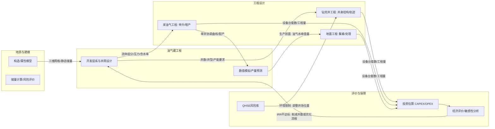

## 石油工程开发架构图

```mermaid

graph LR
    %% 专业模块定义
    subgraph G [地质与建模]
        G1[构造/属性模型]
        G2[储量计算/风险评价]
    end

    subgraph R [油气藏工程]
        R1[开发层系与井网设计]
        R2[数值模拟/产量预测]
    end

    subgraph E [工程设计]
        D1[钻完井工程: 井身结构/轨迹]
        P1[采油气工程: 举升/增产]
        S1[地面工程: 集输/处理]
    end

    subgraph ECO [评价与保障]
        EC1[投资估算 CAPEX/OPEX]
        EC2[经济评价/敏感性分析]
        Q1[QHSE风险库]
    end

    %% 数据硬连接 (落地关键)
    G1 -->|三维网格/静态储量| R1
    R1 -->|井数/井型/产能要求| D1
    R1 -->|流体组分/压力/含水率| P1
    
    P1 -->|单井协调曲线/配产| R2
    R2 -->|生产剖面: 油气水峰值量| S1
    
    D1 & P1 & S1 -->|设备台套数/工程量| EC1
    EC1 --> EC2
    
    %% 反馈循环
    EC2 -->|IRR不达标: 削减井数或优化流程| R1
    Q1 -->|环境限制: 调整井场位置| D1

```